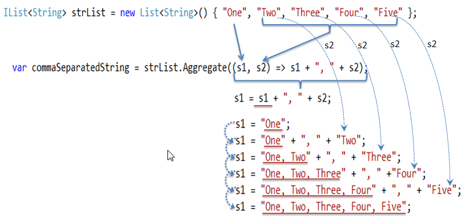

# What's `Aggregate` Method
The Aggregate method performs an accumulate operation. Aggregate extension method has the following overload methods:
```
public static TSource Aggregate<TSource>(this IEnumerable<TSource> source, Func<TSource, TSource, TSource> func);

public static TAccumulate Aggregate<TSource, TAccumulate>(this IEnumerable<TSource> source, TAccumulate seed, Func<TAccumulate, TSource, TAccumulate> func);

public static TResult Aggregate<TSource, TAccumulate, TResult>(this IEnumerable<TSource> source, TAccumulate seed, Func<TAccumulate, TSource, TAccumulate> func, Func<TAccumulate, TResult> resultSelector);
```
<br/>
The following example demonstrates Aggregate method that returns comma separated elements of the string list.

```
IList<String> strList = new List<String>() { "One", "Two", "Three", "Four", "Five"};

var commaSeperatedString = strList.Aggregate((s1, s2) => s1 + ", " + s2);

Console.WriteLine(commaSeperatedString);
```
```
OUTPUT: One, Two, Three, Four, Five
```
<br/>

