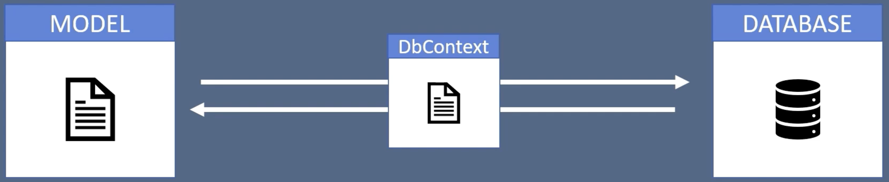

# What's DbContext
- Translater between your model classes and the databse
    
---
- Q: What is the purpose of a db context class in asp.net mvc?
  - A: I would first say that the DbContext class relates to Entity Framework (EF), but then the question tags would suggest you figured that much out yourself. In typical usage, deriving from the DbContext class is simply the way to incorporate EF-based data access into your application. The class that derives from DbContext is, in essence, the data access layer of your application.   So to put it the other way around, if you want to do data access with Entity Framework, DbContext is what you want.  

  © [StackOverflow](https://stackoverflow.com/a/31953580)
---