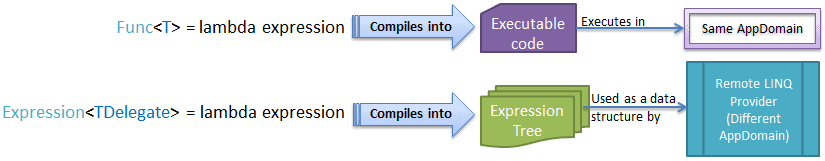

# What's Expression in LINQ
The *lambda Expression* can be assigned to the `Func` or `Action` type delegates to process over **in-memory collections**. The **.NET compiler** converts the lambda expression assigned to `Func` or `Action` type delegate into **executable code** at compile time.

**LINQ** introduced the new type called `Expression` that represents strongly typed lambda expression. It means lambda expression can also be assigned to `Expression<TDelegate>` type. The .NET compiler converts the lambda expression which is assigned to `Expression<TDelegate>` into an **Expression tree** instead of **executable code**. This expression tree is used by remote **LINQ** query providers as a data structure to build a runtime query out of it (such as **LINQ-to-SQL**, **EntityFramework** or any other **LINQ query provider** that implements `IQueryable<T>` interface).

The following figure illustrates differences when the lambda expression assigned to the `Func` or `Action` delegate and the `Expression` in LINQ.   

[More...](https://www.tutorialsteacher.com/linq/linq-expression)