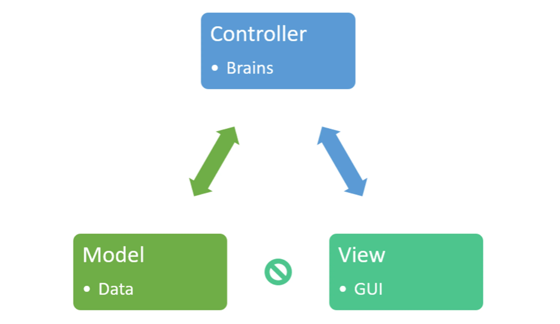
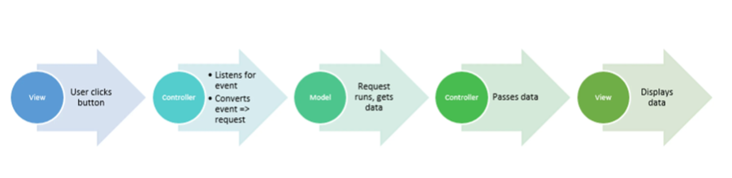
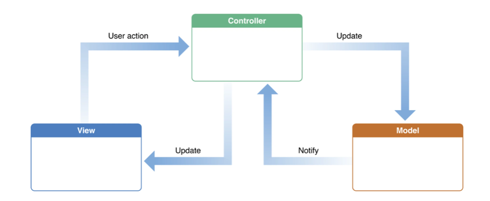

# What is MVC?

- What is MVC Architecture?
  - The architecture components of the MVC pattern are designed to handle different aspects of an application in development. The MVC design pattern serves to separate the presentation layer from the business logic.   Why do developers care about MVC? MVC is popular in app and web development, and it’s one of the most widely used software design patterns for app and web development. The Model View Controller design pattern separates concerns into one of 3 buckets:
    - Model
    - View
    - Controller
    

    The Model View Controller architectural pattern separates concerns into one of 3 buckets:
    - Model: stores & manages data.
        Often a database, in our quick example we’ll use local web storage on a browser to illustrate the concept.
    - View: Graphical User Interface
        The view is a visual representation of the data- like a chart, diagram, table, form.
        The view contains all functionality that directly interacts with the user - like clicking a button, or an enter event.
    - Controller: Brains of the application.
        The controller connects the model and view. The controller converts inputs from the view to demands to retrieve/update data in the model.
        The controller receives input from view, uses logic to translate the input to a demand for the model, the model grabs the data, the controller passes data from the model back to the view for the user to see in a nice display.
---
- Benefits of MVC
  - Traditionally used for Graphical user interfaces (GUIs)
  - Popular in web applications
  - MVC responsibilities are divided between the client & server, compatible with web - application architecture
  - MVC is helpful design pattern when planning development
  - Separation of Concerns: that code is divided based on function to either the model, view, - or controller bucket
  - Works well with Ruby on Rails
  - Loosely Coupled
  - Removes unnecessary dependencies
  - Reuseable without modification
  - MVC makes model classes reusable without modification
  - Code reuse
  - Extendable code
  - High Cohesion
  - Easier to maintain or modify
  - Supports Multiple views
  - Each part can be tested independently (Model, view, controller)
---
- Separation of Concerns
  - MVC design allows for Separation of Concerns - dividing the logic up between the 3 buckets, so that each bucket can act independently.  The model, view, and controller don’t depend on each other. Why does this matter? Generally, software is worked on by teams - a team might have a designer, engineer, and database architect. Separation of concerns means each team member can work on their piece at the same time, because logic has been separated into buckets. Separation of concerns is also great for maitenance - developers can fix a bug in one piece of code, without having to check out the other pieces of code.
---
- Loosely Coupled
  - Loosely coupled means that each piece: the model, view and controller, act independently of eachother.  Developers can modify one of the pieces, and the other 2 pieces should keep working and not require modifications. When designing MVC software – the logic in each of the three buckets is independent. Everything in View acts independently of the model – and vice verse, the view won’t have any logic dependent on the model.  Making independent models and views makes code organization simple and easy to understand and keeps maintenance easier. Programmers can fix a bug in the view without changing the model code.
  
  
  The pictures above show what happens in a MVC web app when a user clicks a button, from the perspective of the user.